# 🧬 GitOps & CI/CD Strategy
### `develop` ➔ `testing` Promotion Pipeline

This document outlines the automated lifecycle of code within this repository. We have migrated from manual merges to a **Trigger-Based Promotion Model** to ensure environment parity and developer productivity.

---

## 🗺️ The Workflow Architecture

```mermaid
graph LR
    A[📂 Feature Branch] -- "Manual PR" --> B(🛠️ devGA Branch)
    B -- "GitHub Action Trigger" --> C{🤖 Auto-Create PR}
    C --> D(🧪 testingGA Branch)
    D -- "Deployment" --> E{{🚀 QA Environment}}
```

## 🛠 How it Works

- Development: Developers merge their feature PRs into the devGA branch.
- Auto-PR: A GitHub Action triggers on every push to devGA. It automatically creates a Pull Request from devGA into testingGA.
- Template: The automated PR (and all manual PRs) uses our standard template to ensure QA has the context they need to test.
- Protection: Direct commits to testingGA are disabled. All code must enter via the automated PR.

## 📝 Implementation Steps (How I Built This)

- Created the Automation Workflow
    - Developed a GitHub Actions YAML file located at .github/workflows/promote-to-testing.yml. This script 
    - uses the gh (GitHub CLI) to detect changes in develop and programmatically open a PR against testing 
    - if one doesn't already exist.

- Standardized the Pull Request Format
    - Created a Markdown template at .github/pull_request_template.md. This pre-fills the description box 
    - whenever a new PR is opened, forcing a "How to Test" section and a "Quality Checklist."

- Configured Repository Permissions

    Under Settings > Actions > General, I enabled:
    - Read and write permissions (Allowing the bot to push code).
    - Allow GitHub Actions to create and approve pull requests (Allowing the bot to open the PR).

- Enforced Branch Protection

    Navigated to Settings > Branches and added a protection rule for testing :
    - Enabled "Require a pull request before merging".
    - This effectively blocks direct git push commands, ensuring all code follows the automated pipeline.

## 📁 Key Files

- .github/workflows/promote-to-testing.yml - The automation engine.
- .github/pull_request_template.md - The UI for our PR descriptions.

## ✅ Team Benefits

- No Manual Toil: No one has to remember to "sync" the testing branch.
- Traceability: Every QA build has a clear PR history showing exactly what changed.
- Safety: Branch protection prevents accidental overrides of the testing environment.

## 🚨 Troubleshooting & FAQ

What if the Auto-PR fails?

This typically occurs during a Merge Conflict. If testingGA has drifted from devGA due to a manual change, the automation will pause. You must resolve the conflict manually via a temporary branch.